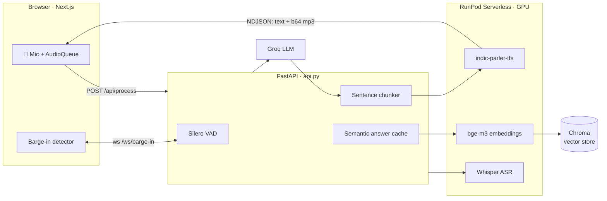

# SettleAI — Nepali Voice Assistant

A real-time, full-duplex voice assistant that listens and replies in **Nepali**, grounded
in a retrieval corpus so it answers from real documents instead of hallucinating.

Speech in → speech out, streamed sentence by sentence, with barge-in: start talking over
the assistant and it stops mid-reply and listens.

**🌐 Live demo — [settle-ai-nepali-voice-assistance.vercel.app](https://settle-ai-nepali-voice-assistance.vercel.app)**

> The GPU backends are scale-to-zero RunPod endpoints and are usually asleep, so the live
> site detects the missing backend and plays a pre-rendered Nepali reply instead of
> erroring. Click **Hear a demo** on the landing page.
> ▶️ [`settleai-nepali-demo.mp3`](frontend/public/demo/settleai-nepali-demo.mp3)

```
नमस्ते, यो सेटल-एआई हो। यो एउटा नेपाली भ्वाइस असिस्टेन्ट हो। अहिले म उपलब्ध छैन।
"Hello, this is SettleAI. This is a Nepali voice assistant. Right now I am not available."
```

---

## What happens in one turn

1. **Endpointing** — Silero VAD scores 32 ms frames in-browser-to-server and decides when
   you've stopped speaking (`vad.py`), keeping 300 ms of pre-speech padding so the first
   syllable isn't clipped.
2. **ASR** — the clip goes to Whisper (`asr/`), which has three interchangeable backends:
   NVIDIA-hosted `whisper-large-v3`, a self-hosted RunPod worker, or in-process
   `transformers` for dev machines.
3. **Retrieval** — the question is embedded with `BAAI/bge-m3` and matched against a Chroma
   store; a relevance score decides whether to answer, ask for a rephrase, or decline
   (`rag/service.py`).
4. **Generation** — Groq streams a Nepali reply token by token (`llm.py`).
5. **Speech** — tokens are chunked at clause/sentence boundaries and synthesized
   **concurrently** by `ai4bharat/indic-parler-tts`, so audio starts playing while the LLM
   is still writing (`api.py`, `tts.py`).
6. **Barge-in** — while audio plays, the browser streams mic frames over `/ws/barge-in`;
   three consecutive speech frames cancel playback and reopen the mic.

Each sentence is pushed to the browser as a line of NDJSON — `{type, text, audio}` — so
playback begins on sentence one instead of waiting for the whole reply.

## Architecture



## Latency

Getting a voice agent under a few seconds per turn was most of the engineering. All figures
below come from this repo's own instrumentation — `perf.py`'s `timed()` writes every stage
to `logs/app.log`, and these are percentiles over **397 records**, split by the deploy that
moved TTS onto a dedicated GPU endpoint and removed a translation hop.

| Stage | Before (p50) | After (p50) | |
|---|---|---|---|
| **`tts.synthesize`** — speech for one reply | **61.3 s** | **3.7 s** | **~16× faster** (n=106) |
| `llm.chat_completion_stream` — full stream | 117.4 s | 6.6 s | n=42 |
| `rag.similarity_search` | 248 ms | *(1.2 s)* | see note (n=39) |
| `rag.translate` — query → English | 3.9 s | **removed** | `bge-m3` is multilingual |
| `rag.fetch_pages` | 6 ms | 2 ms | in-memory (n=33) |
| **Cache hit** — repeat question | — | **1 ms** | full pipeline skipped |

<sub>*Note: `rag.similarity_search` got slower in absolute terms — the "before" numbers ran
against a local embedding model, the "after" against a remote GPU endpoint that pays a
network round trip. It was still a net win: it deleted the 3.9 s translation hop entirely
and materially improved retrieval quality on Nepali queries.*</sub>

**What actually made it fast**

- **Never call `/runsync`.** RunPod's queue-dispatch wait routinely exceeded the sync
  timeout even against a warm worker, and a timed-out `/runsync` doesn't return the job id
  it already created — so the old fallback silently submitted a *duplicate* job every time,
  compounding the backlog. This alone caused 90 s+ replies. Always `/run` + poll
  (`tts.py`).
- **Overlap TTS with generation.** Up to `TTS_MAX_CONCURRENT` sentences synthesize at once
  while the LLM is still writing, output order preserved: ~52 s of raw synthesis costs ~27 s
  of wall clock on a four-sentence reply.
- **Start speaking sooner.** The *first* chunk splits at a clause boundary rather than a
  sentence, so playback begins on a comma instead of waiting for a full stop.
- **Semantic answer cache.** Questions are matched by embedding cosine similarity (≥ 0.92),
  so a rephrased repeat is served in ~1 ms rather than re-running the pipeline.
- **Don't split names.** Sentence splitting ignores abbreviation periods (`Er.`, `डा.`) —
  these were fragmenting a faculty-list answer into **13** TTS calls instead of **2**, which
  both multiplied cost and broke pronunciation.
- **Cheaper endpointing.** `SILENCE_AFTER_SPEECH` 1.2 s → 0.9 s trimmed 300 ms from every
  single turn, without clipping natural pauses.
- **Keepalives.** RunPod's proxy kills a connection that goes quiet, which it does while the
  LLM thinks — so the stream emits a blank NDJSON line every second (`api.py`, `lib/api.ts`).

> Measured against warm workers. The RunPod endpoints are scale-to-zero, so the first
> request after an idle period pays a cold start before any of this applies.

## Other engineering notes

- **Retrieval thresholds were measured, not guessed.** Scored 14 on-topic and 10 off-topic
  Nepali questions against the live store; the bands nearly touch (on-topic 0.358–0.563,
  off-topic 0.023–0.344). The inherited 0.45 cutoff sat *inside* the on-topic range and was
  sending 6 of 14 valid questions to a "please rephrase" dead end. Recalibrated to 0.35 —
  reasoning in `config.py`.
- **Temperature is a correctness knob here.** At 0.7 the same question returned different
  *facts* across runs — once the correct college name, once an invented one. Dropped to 0.3;
  for a retrieval-grounded assistant, stability beats phrasing variety.
- **The system prompt bans markdown** for a mechanical reason: a bulleted list has no
  sentence terminators, so the chunker can't split it — the whole list becomes one giant TTS
  call, and the bullet characters get read aloud.
- **`asr_worker/` exists because hosted Whisper wasn't enough.** NVIDIA's `whisper-large-v3`
  degenerates into repetition loops on Nepali, and Riva's `RecognitionConfig` exposes no
  decoding knobs to suppress it — hence a self-hosted worker where they're reachable.

## Repo map

| Path | |
|---|---|
| `api.py` | FastAPI app — NDJSON streaming, sentence chunking, semantic cache, barge-in socket |
| `vad.py` | Silero VAD endpointing |
| `asr/` | Whisper backends: `whisper_nvidia`, `whisper_runpod`, `whisper_local` |
| `llm.py` | Groq chat client with streaming + bounded history |
| `rag/` | Chroma store, `bge-m3` embeddings, scraper, retrieval service |
| `tts.py` | Swappable TTS engines — `RunPodIndicParlerTTS` (active), `GTTSEngine` |
| `perf.py` | The `timed()` helper behind every number in the Latency section |
| `cli_demo.py` | Terminal entry point — same pipeline, no browser |
| `asr_worker/`, `tts_worker/` | RunPod Serverless GPU worker images |
| `frontend/` | Next.js app — chat UI, mic capture, audio queue, barge-in |
| `slack_bot/` | Optional Socket Mode listener that live-ingests Slack into the RAG store |
| `data/` | `faq.json` — structured KEC directory data expanded by `scripts/ingest_faq.py` |
| `scripts/` | Ingestion, LLM diagnostics, demo-clip generator |

## Running it locally

```bash
python -m venv .venv && source .venv/bin/activate
pip install -r requirements_local.txt      # requirements_api.txt for the server only
cp .env.example .env_local                 # then fill in your keys
uvicorn api:app --reload                   # http://localhost:8000
```

```bash
cd frontend && npm install
echo "NEXT_PUBLIC_API_URL=http://localhost:8000" > .env.local
npm run dev                                # http://localhost:3000
```

The frontend runs without a backend — it detects the missing API and serves the recorded
demo reply, which is also how the deployed site behaves.

Other entry points:

```bash
python cli_demo.py                 # voice loop in the terminal, no browser
python -m scripts.check_llm        # diagnose the configured LLM endpoint
python -m scripts.ingest_faq       # rebuild the RAG store from data/faq.json
python -m scripts.make_demo_clip   # regenerate the offline demo audio
```

## Deployment

| Piece | Where |
|---|---|
| Frontend | Vercel, auto-deploys from `main` |
| API (`api.py`) | RunPod pod, `https://<pod-id>-8000.proxy.runpod.net` |
| ASR / TTS / embeddings | Three RunPod Serverless endpoints, scale-to-zero |
| LLM | Groq |

> ⚠️ `NEXT_PUBLIC_API_URL` is baked into the frontend bundle at **build** time. If the pod
> is recreated it gets a new hostname, and updating the Vercel env var alone does nothing —
> the frontend must be rebuilt.

## License

MIT — see [LICENSE](LICENSE).
